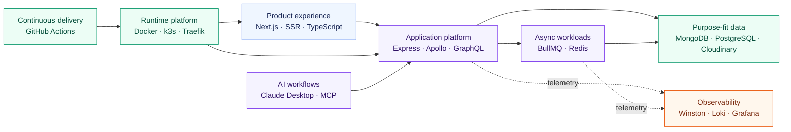
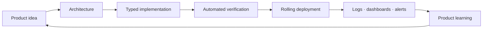

<div align="center">

# Hi, I'm Edogawa Tr 👋

### Product Person 

I design products as systems with **modern and powerful tech stack** (I call **Gen-Z Stack**) — from the user experience and API contracts<br />
to asynchronous workflows, infrastructure, delivery, and observability.

## 🚀 Current Development Stack
### Programming Language
[](https://www.typescriptlang.org/)
### Backend & API
[](https://expressjs.com/)
[](https://nextjs.org/)
[](https://www.apollographql.com/)
[](https://graphql.org/)
### Database & Cache
[](https://www.postgresql.org/)
[](https://www.mongodb.com/)
[](https://redis.io/)
### Background Jobs
[](https://bullmq.io/)
### Infrastructure & Observability
[](https://kubernetes.io/)
[](https://grafana.com/)
[](https://grafana.com/oss/loki/)

## 💻 Supported Operating Systems
[](https://ubuntu.com/)
[](https://archlinux.org/)
[](https://www.debian.org/)

</div>

---

## About me

I'm a product-minded architect who enjoys turning ambitious ideas into reliable, operable platforms. My work sits at the intersection of **product thinking, application architecture, and infrastructure engineering**.

I care about the full path from concept to production:

- shaping a product into clear services and boundaries;
- building type-safe experiences and APIs;
- choosing the right data store for each workload;
- moving expensive work into resilient asynchronous pipelines;
- automating delivery with containers and Kubernetes; and
- making systems understandable through logs, dashboards, and alerts.

```text
Product intent → System design → Working software → Reliable operations
```

## What I build

| Focus | How I approach it |
|---|---|
| **Product architecture** | Translate product requirements into clear domains, services, data flows, and technical trade-offs |
| **Full-stack platforms** | Build SSR experiences and typed APIs with Next.js, TypeScript, Express, and GraphQL |
| **Cloud-native systems** | Package services with Docker and operate them on lightweight Kubernetes with k3s |
| **Event-driven workflows** | Keep interactive paths responsive by moving heavy work into Redis-backed BullMQ workers |
| **Data platforms** | Combine document, relational, cache, queue, and media storage around workload needs |
| **Developer experience** | Create repeatable local environments and automated build, test, and deployment pipelines |
| **Observability** | Treat structured logging, aggregation, dashboards, and alerts as part of the architecture |
| **AI integration** | Connect AI clients to internal capabilities through deliberate, controlled MCP tools |

## Flagship project · The Blue Whale

> A production-grade, Kubernetes-orchestrated, GraphQL-powered, event-driven web platform.

**The Blue Whale** represents how I think about modern product infrastructure: the frontend, backend, background processing, data layer, delivery pipeline, AI integration, and operations should work as one coherent system.

### System at a glance



### Delivery philosophy



## Currently exploring

- Event-driven and queue-based architectures for real-world workloads
- Practical AI-assisted workflows through MCP
- Lightweight, self-managed infrastructure tools: Kubernetes / Harbor / Prometheus / Thanos

---

<div align="center">

### Let's build products that are useful, scalable, and operable.

<sub>Product thinking in the front. Platform discipline underneath.</sub>

</div>
