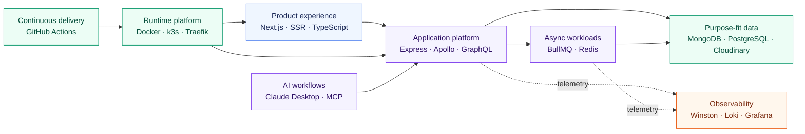
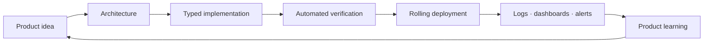

<div align="center">

# Hi, I'm Edogawa Tr 👋

### Product Person 

I design products as systems with **modern and powerful tech stack** (I call **Gen-Z Stack**) — from the user experience and API contracts<br />
to asynchronous workflows, infrastructure, delivery, and observability.

[](https://www.typescriptlang.org/)
[](https://nextjs.org/)
[](https://www.apollographql.com/)
[](https://graphql.org/)
[](https://bullmq.io/)
[](https://kubernetes.io/)
[](https://www.mongodb.com/)
[](https://redis.io/)
[](https://grafana.com/)

</div>

---

## About me

I'm a product-minded architect who enjoys turning ambitious ideas into reliable, operable platforms. My work sits at the intersection of **product thinking, application architecture, and infrastructure engineering**.

I care about the full path from concept to production:

- shaping a product into clear services and boundaries;
- building type-safe experiences and APIs;
- choosing the right data store for each workload;
- moving expensive work into resilient asynchronous pipelines;
- automating delivery with containers and Kubernetes; and
- making systems understandable through logs, dashboards, and alerts.

```text
Product intent → System design → Working software → Reliable operations
```

## What I build

| Focus | How I approach it |
|---|---|
| **Product architecture** | Translate product requirements into clear domains, services, data flows, and technical trade-offs |
| **Full-stack platforms** | Build SSR experiences and typed APIs with Next.js, TypeScript, Express, and GraphQL |
| **Cloud-native systems** | Package services with Docker and operate them on lightweight Kubernetes with k3s |
| **Event-driven workflows** | Keep interactive paths responsive by moving heavy work into Redis-backed BullMQ workers |
| **Data platforms** | Combine document, relational, cache, queue, and media storage around workload needs |
| **Developer experience** | Create repeatable local environments and automated build, test, and deployment pipelines |
| **Observability** | Treat structured logging, aggregation, dashboards, and alerts as part of the architecture |
| **AI integration** | Connect AI clients to internal capabilities through deliberate, controlled MCP tools |

## Flagship project · The Blue Whale

> A production-grade, Kubernetes-orchestrated, GraphQL-powered, event-driven web platform.

**The Blue Whale** represents how I think about modern product infrastructure: the frontend, backend, background processing, data layer, delivery pipeline, AI integration, and operations should work as one coherent system.

### System at a glance



### Architecture decisions behind it

| Decision | Product and engineering value |
|---|---|
| **Next.js SSR with App Router** | Fast, indexable product experiences with a modern component model |
| **GraphQL on Express** | A flexible API contract with room for REST interoperability and subscriptions |
| **JWT, OAuth, and Zod** | Explicit identity, authorization, and runtime validation boundaries |
| **BullMQ workers** | Reliable processing for media and avatar workloads outside the request path |
| **MongoDB + PostgreSQL** | Document flexibility for product data and relational integrity for identity data |
| **Redis** | Shared foundation for queues, cache, and session workloads |
| **MCP server** | Controlled access to internal platform tools from Claude Desktop |
| **k3s + Traefik** | A compact, self-managed Kubernetes runtime with ingress and automated TLS |
| **GitHub Actions** | Repeatable build, test, image publication, and rolling deployment |
| **Winston → Loki → Grafana** | Structured, searchable telemetry from services to operational dashboards |

### Delivery philosophy



## Technical toolbox

| Domain | Tools and technologies |
|---|---|
| **Frontend** | Next.js, React, App Router, SSR, TypeScript |
| **API & backend** | Node.js, Express.js, Apollo Server, GraphQL, subscriptions, Zod |
| **Identity & security** | JWT, OAuth, authorization boundaries, runtime validation |
| **Async processing** | BullMQ, Redis, scheduled jobs, worker services, Bull Board |
| **Data** | MongoDB Atlas, PostgreSQL, Prisma ORM, Redis |
| **Media** | Cloudinary, asynchronous upload workflows, CDN delivery |
| **Infrastructure** | Docker, Docker Compose, Kubernetes, k3s, Traefik, cert-manager |
| **CI/CD** | GitHub Actions, container registries, rolling deployments |
| **Observability** | Winston, Morgan, Loki, Grafana, structured JSON logging |
| **AI systems** | Model Context Protocol, MCP servers, Claude Desktop integration |

## How I think about systems

1. **Start with the product outcome.** Architecture should explain how it creates user and business value.
2. **Keep boundaries explicit.** APIs, queues, databases, and internal tools need clear ownership and contracts.
3. **Use the right tool for the workload.** One database or execution model rarely fits every concern.
4. **Move slow work out of the request path.** Async processing protects responsiveness and resilience.
5. **Automate the path to production.** Repeatability is a prerequisite for safe iteration.
6. **Design for operation, not just deployment.** A system is only production-ready when teams can understand its behavior.
7. **Give AI deliberate access.** Tool-based integrations should expose useful capabilities without opening unrestricted paths.

## Currently exploring

- Product platforms that balance delivery speed with operational clarity
- Event-driven and queue-based architectures for real-world workloads
- Practical AI-assisted workflows through MCP
- Lightweight, self-managed Kubernetes environments
- Better feedback loops between product decisions and production telemetry

---

<div align="center">

### Let's build products that are useful, scalable, and operable.

<sub>Product thinking in the front. Platform discipline underneath.</sub>

</div>
